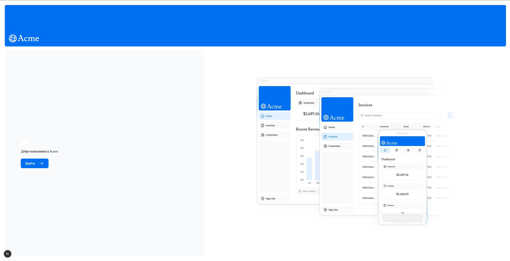
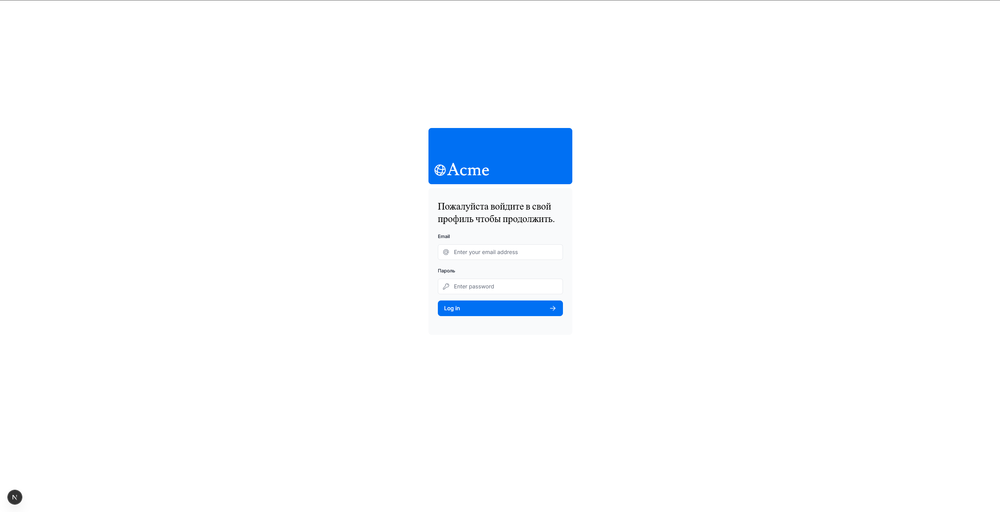
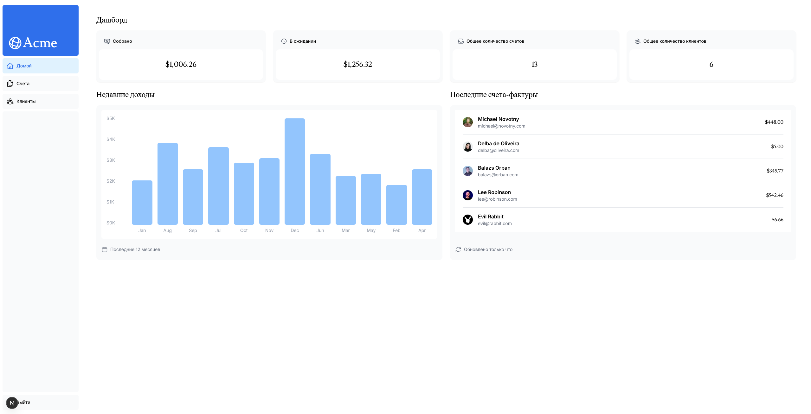
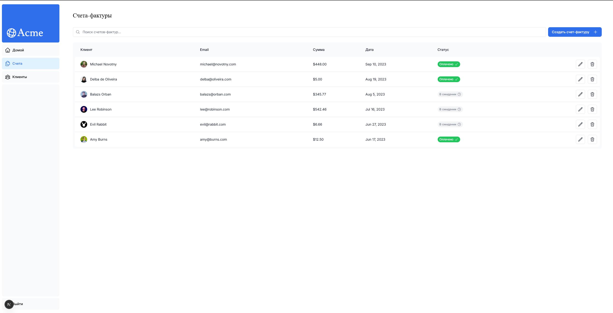
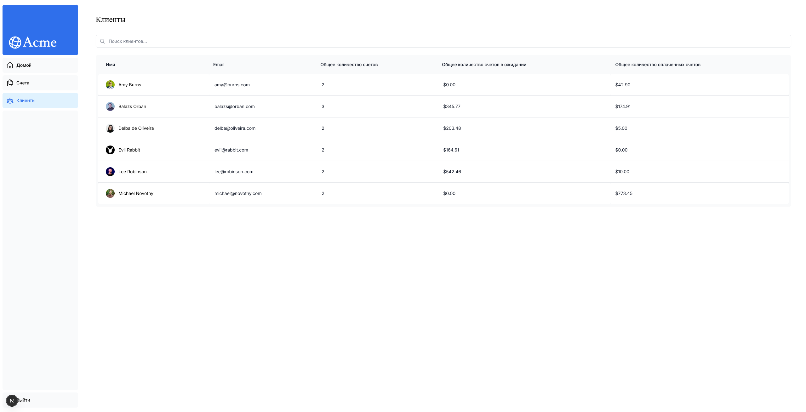
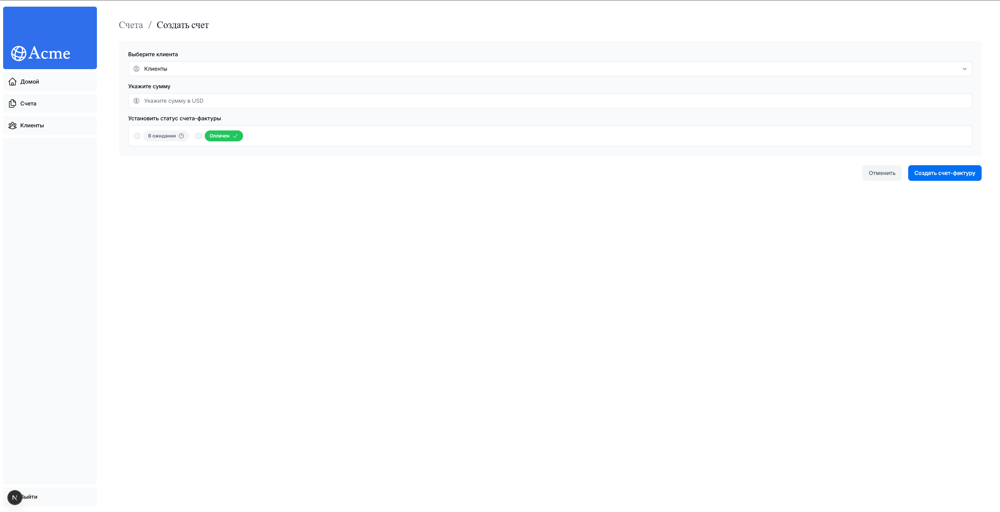

# 📊 Next.js Dashboard

Учебный проект из официального курса Next.js Learn — финансовая панель управления с аутентификацией, CRUD-операциями над invoices и защищёнными маршрутами.

**Технологии:**

## 📋 Функционал

- Публичная домашняя страница
- Страница логина с аутентификацией
- Защищённый dashboard с invoices и customers
- Добавление, редактирование, удаление счетов

## 🖼️ Скриншоты

| Домашняя страница              | Вход в систему                  | Dashboard                               |
| ------------------------------ | ------------------------------- | --------------------------------------- |
|  |  |  |

| Счета                                 | Клиенты                             | Cоздание счета                                |
| ------------------------------------- | ----------------------------------- | --------------------------------------------- |
|  |  |  |

## 📚 Что изучено

- App Router (layouts, pages, loading.tsx)
- Server Components и Client Components
- Middleware для аутентификации
- Работа с базой данных (в курсе — Postgres)

## 🔗 Ссылки

- [Официальный курс Next.js](https://nextjs.org/learn/dashboard-app)
- [Демо на Vercel](https://vercel.com/arthurfilatovs-projects/study-dashboard-project)
